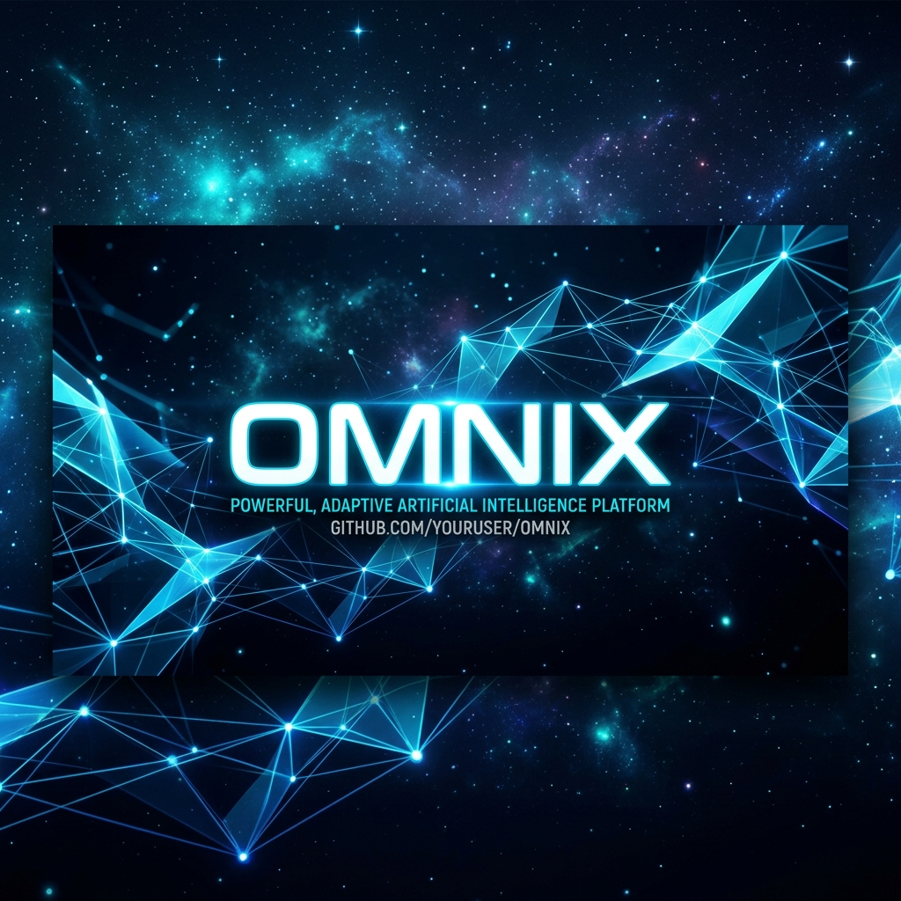

# Omnix: An AI Agent Orchestration Dashboard

<p align="center">
  
</p>

Building autonomous agents is one thing, but managing them at scale is another. **Omnix** is a platform I built to deploy, track, and debug AI agents in real-time. It’s designed to give you a clear window into what your agents are "thinking" as they execute complex missions.

---

### 💡 The Core Idea

The goal with Omnix was to create a reliable control center for agentic workflows. Instead of checking logs in a terminal, you get a cinematic dashboard that streams agent thoughts via WebSockets.

*   **Mission Control**: Launch and stop agent runs with a single click.
*   **Live Streams**: Real-time telemetry so you can watch agents reason through tasks.
*   **Observability**: Integrated with **AgentOps** so you can track every LLM call, token cost, and latency spike.
*   **Global State**: Uses **Upstash Redis** to keep agent state synced across different sessions and workers.

### 🛠 Tech Stack

I picked these tools to ensure the system handles high-velocity data without breaking:

*   **Frontend**: Next.js 14 (App Router) with Tailwind CSS and Framer Motion for the UI.
*   **Backend**: FastAPI (Python) for the heavy lifting and WebSocket management.
*   **Inference**: Groq for ultra-fast response times and VoyageAI for embeddings.
*   **Auth**: Managed via Clerk for secure, hassle-free user sessions.

---

### 🚀 Getting Started

To get the full system running locally:

#### 1. Clone the repo
```bash
git clone https://github.com/AnmolGarg8/Omnix.git
cd Omnix
```

#### 2. Backend Setup
1. `cd backend`
2. Create a venv and install dependencies: `pip install -r requirements.txt`
3. Set up your `.env` (check `.env.example` for the keys you'll need).
4. Run: `uvicorn main:app --reload`

#### 3. Frontend Setup
1. `cd ../frontend`
2. `npm install`
3. `npm run dev`

Once both are running, the dashboard should be accessible at `localhost:3000`.

---

### 📂 How it's built

*   **/backend**: FastAPI routers handle the logic for agent runs, settings, and database connections.
*   **/frontend**: The Next.js app handles the dashboard UI, mission status tracking, and the WebSocket client.

---

Built by [Anmol Garg](https://github.com/AnmolGarg8)
