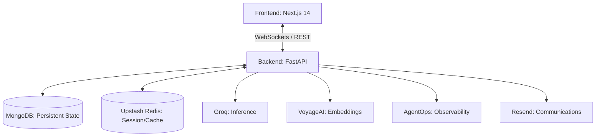

# 🌌 Omnix | Enterprise AI Agent Orchestration

<p align="center">
  
</p>

<p align="center">
  <a href="https://nextjs.org/"></a>
  <a href="https://fastapi.tiangolo.com/"></a>
  <a href="https://www.mongodb.com/"></a>
  <a href="https://clerk.com/"></a>
</p>

---

## 📖 Overview

**Omnix** is a state-of-the-art AI Agent Orchestration platform designed for low-latency, high-reliability mission management. It bridges the gap between raw LLM capabilities and production-grade reliability by providing a robust infrastructure for deploying, monitoring, and scaling autonomous agents.

Built with a focus on **observability** and **performance**, Omnix leverages the speed of **Groq** for sub-second inference and the precision of **VoyageAI** for context-aware embeddings, all managed through a sleek, cinematic dashboard.

---

## ✨ Core Features

- **🚀 Mission Control Center:** A unified command center to launch, stop, and audit complex agent workflows.
- **🛰️ Live Telemetry:** Real-time agent thought-process streaming via high-throughput WebSockets.
- **🧠 Hybrid Intelligence:** Orchestrate missions using a combination of **Groq** (Speed) and **OpenAI/Anthropic** (Depth) models.
- **🛡️ Enterprise Security:** RBAC and multi-tenant authentication powered by **Clerk**.
- **📈 Deep Observability:** Integrated with **AgentOps** for full-stack tracing, cost analysis, and performance benchmarking.
- **⚡ Reactive Persistence:** Global state management using **Upstash Redis** for sub-millisecond data retrieval.
- **🔔 Proactive Notifications:** Automated mission reports and critical alerts delivered via **Resend**.

---

## 🏗️ System Architecture



---

## 🛠️ Tech Stack

| Layer | Technology |
| :--- | :--- |
| **Frontend** | Next.js 14, Framer Motion, Tailwind CSS, Shadcn UI |
| **Backend** | FastAPI (Python 3.11+), Pydantic v2, Motor |
| **AI/ML** | Groq, VoyageAI, AgentOps (Observability) |
| **Database** | MongoDB (Persistence), Upstash Redis (Caching) |
| **Auth/Comm** | Clerk (Auth), Resend (Email) |
| **DevOps** | Docker, Docker Compose, Vercel |

---

## 🚀 Quick Start

### 1. Environment Preparation
Ensure you have Python 3.10+, Node.js 18+, and Docker installed.

### 2. Repository Setup
```bash
git clone https://github.com/AnmolGarg8/Omnix.git
cd Omnix
```

### 3. Backend Deployment
```bash
cd backend
python -m venv venv
source venv/bin/activate # Windows: .\venv\Scripts\activate
pip install -r requirements.txt
cp .env.example .env
uvicorn main:app --reload --port 8000
```

### 4. Frontend Deployment
```bash
cd ../frontend
npm install
cp .env.local.example .env.local
npm run dev
```

---

## 🧪 Technical Challenges & Solutions

### 1. Real-time Log Streaming
**Challenge:** Managing high-velocity agent logs without overwhelming the frontend or database.
**Solution:** Implemented a non-blocking WebSocket architecture in FastAPI that broadcasts events to the dashboard while asynchronously batching logs to MongoDB.

### 2. Agent Cost & Performance Tracking
**Challenge:** Lack of visibility into token usage and agent latency across multiple providers.
**Solution:** Integrated **AgentOps** to provide deep-level tracing of every LLM call, enabling real-time cost tracking and performance bottleneck identification.

### 3. Distributed State Management
**Challenge:** Syncing agent state across multiple workers in a containerized environment.
**Solution:** Leveraged **Upstash Redis** as a global state store, ensuring consistency even as the system scales horizontally.

---

## 🤝 Contributing

Contributions are what make the open-source community such an amazing place to learn, inspire, and create. Any contributions you make are **greatly appreciated**.

1. Fork the Project
2. Create your Feature Branch (`git checkout -b feature/AmazingFeature`)
3. Commit your Changes (`git commit -m 'Add some AmazingFeature'`)
4. Push to the Branch (`git push origin feature/AmazingFeature`)
5. Open a Pull Request

---

## 📝 License

Distributed under the MIT License. See `LICENSE` for more information.

---

<p align="center">
  Developed with focus by <a href="https://github.com/AnmolGarg8">Anmol Garg</a>
</p>
